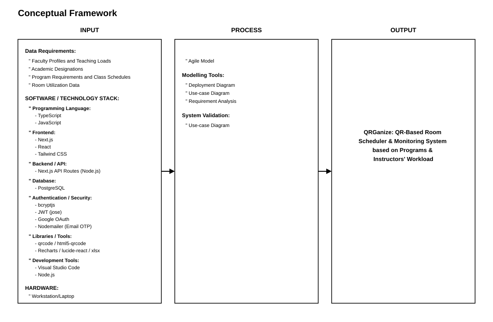

# QRganize
### Academic Scheduling & Room Utilization System

> A web-based system for managing instructor workloads, scheduling classes, and monitoring room utilization through QR code scanning — built for higher education institutions.

---

## Use Case Diagram

<p align="center">
  
</p>

---

## Conceptual Framework

<p align="center">
  
</p>

> Full text version (for thesis copy/paste): [`docs/conceptual-framework.md`](docs/conceptual-framework.md)

---

## Use Cases

| # | Use Case | Description |
|---|---|---|
| 1 | **Login** | Authenticates the Academic Administrator into the system |
| 2 | **View Real-Time Dashboard** | Displays live statistics: programs, faculty, blocks, scheduled subjects, room usage, and today's QR scan activity |
| 3 | **Manage Programs & Curriculum** | Create and manage academic programs; define subjects per year level and semester (Old/New curriculum). Download an official NEMSU Excel template and re-import it after review — nothing is saved until Confirm |
| 4 | **Manage Faculty Workloads** | View and track workload assignments per faculty; monitors regular load vs. overload for permanent and contractual faculty |
| 5 | **Create Student Blocks** | Create block sections (A, B, C…) per program, year level, and semester; subjects are auto-loaded from the curriculum |
| 6 | **Assign Instructor Workload** | Assign faculty to block subjects; system auto-computes workload units and tracks regular/overload split |
| 7 | **Schedule Classes** | Set the day pattern, start time, and room for each assigned subject; handles Lecture-only, Lab-only, and Lec+Lab subjects separately |
| 8 | **Detect Schedule Conflicts** | Automatically prevents overlapping schedules for instructor, block section, and room during class scheduling |
| 9 | **Generate Class Program** | Auto-generate the printable Class Program per block; export to Excel or print as PDF |
| 10 | **Scan Room QR Code** | Faculty scan the room's QR code on entry; system logs the scan with timestamp and room ID |
| 11 | **Monitor Room Utilization** | View real-time room usage logs; flags late entries (>15 minutes) and overuse (duplicate scans same room/day) |
| 12 | **Logout** | Ends the authenticated administrator session securely |

---

## System Flow

```
┌──────────────────── SETUP (Foundation — do first) ─────────────────────┐
│                                                                         │
│   01. Programs & Curriculum    02. Faculty Profiles    03. Rooms        │
│       (subjects, units, hrs)       (limits, type)         (lec / lab)  │
│                                                                         │
└──────────────────────────────────┬──────────────────────────────────────┘
                                   │
                                   ▼
                        04. Create Student Blocks
                            Subjects auto-loaded from curriculum
                                   │
                                   ▼
                        05. Assign Instructor Workload
                            Faculty linked to block subjects
                            Workload units computed
                            Regular load and overload tracked
                                   │
                                   ▼
                        06. Schedule Classes
                            Day pattern + start time + room
                            Lec+Lab → separate rooms
                            Conflicts auto-detected
                                   │
                                   ▼
                        07. Generate Class Program
                            Printable output per block
                            Export to Excel / PDF
                                   │
                                   ▼
                        08. QR Room Validation  (Ongoing)
                            Faculty scan on room entry
                            Late and overuse flags logged
```

---

## Subject Status Flow

```
Unscheduled  ──►  Assigned  ──►  Scheduled
(loaded into      (faculty        (has day, time,
 block, no         assigned)       room — appears
 instructor)                       in Class Program)
```

> Removing an instructor resets the subject back to **Unscheduled**.

---

## Workload Rules

### Permanent Faculty
| Rule | Value |
|---|---|
| Regular load limit | **18 units** |
| Designation deduction | Yes — deducted from 18 |
| Praise (non-teaching) | Allowed |
| Excess over limit | Counted as **Overload** |

### Contractual Faculty
| Rule | Value |
|---|---|
| Regular load limit | **30 hours** |
| Designation deduction | Not applicable |
| Praise assignments | Not allowed |
| Excess over limit | Counted as **Overload** |

### Workload Unit Formula
```
Lecture Workload Units  =  round(lecture_hours × 0.75)
Lab Workload Units      =  lab_hours × 0.75  (exact decimal)
```

---

## Class Program — Lec+Lab Display Rule

For subjects with both Lecture and Lab, the Class Program automatically splits them into **two rows**:

| Row | Units | Hours | Example |
|---|---|---|---|
| Lecture | `lecture_hours` | `lecture_hours` | 2 units / 2 hrs |
| Laboratory | `total_units − lecture_units` | `laboratory_hours` | 1 unit / 3 hrs |

> **Total:** 3 units / 5 hrs for a standard 3-unit Lec+Lab subject.

---

## Tech Stack

| Layer | Technology |
|---|---|
| Language | TypeScript / JavaScript |
| Framework | Next.js 16 (App Router) |
| UI | React 19 + Tailwind CSS |
| Backend | Next.js API Routes |
| Database | PostgreSQL |
| Authentication | Cookie-based JWT (jose), bcryptjs, Google OAuth, Email OTP |
| Excel | ExcelJS (official curriculum download), SheetJS/`xlsx` (flexible import) |
| Print | Browser Print API (curriculum, class program, workload) |
| QR Scanning | qrcode / html5-qrcode (camera + upload) |x

---

## Database Tables

| Table | Purpose |
|---|---|
| `programs` | Academic program definitions |
| `curriculums` | Subjects per program, year, and semester |
| `faculty` | Faculty profiles and employment status |
| `blocks` | Student sections per program/year/semester |
| `block_subjects` | Subjects loaded into each block |
| `master_schedule` | One schedule entry per block subject |
| `instructor_loads` | Faculty-to-subject workload assignments |
| `schedule_sessions` | Per-session day, time, and room records |
| `rooms` | Lecture and laboratory rooms |
| `overloads` | Excess workload tracking records |
| `praise` | Non-teaching assignments for permanent faculty |
| `qr_scan_logs` | QR validation logs with timestamps and flags |
| `system_settings` | Global options such as the system / NEMSU logo URL |

---

## Curriculum Excel

Administrators can download a professional NEMSU curriculum workbook (logo, university header, year/semester sections, `SUM()` totals) and upload the same file — or another Excel layout — back into QRganize.

- **Download** does not change the database.
- **Upload** only parses and shows a Review step (detected program, year/semester, new / existing / changed rows).
- **Confirm** is the only action that writes to PostgreSQL.
- Decorative rows (logo, titles, TOTAL, footer) are ignored. Headers are matched by name, not row number.

```bash
npm test
```

Runs the curriculum import and export checks in `src/lib/curriculumImport` and `src/lib/curriculumExport`.

---

## Getting Started

Full setup (PostgreSQL, `.env.local`, first admin) is in [`HOW_TO_RUN.md`](HOW_TO_RUN.md).

```bash
npm install
npm run dev
```

Open [http://localhost:3000](http://localhost:3000) in your browser.

---

## Project Structure

```
src/
├── app/
│   ├── (dashboard)/              # Admin & department chair
│   │   ├── dashboard/
│   │   ├── program/
│   │   │   ├── curriculum/       # Subjects, Excel download / import
│   │   │   ├── faculty/
│   │   │   ├── blocks/
│   │   │   └── class-program/
│   │   ├── workload/
│   │   ├── scheduling/
│   │   ├── rooms/
│   │   ├── qr-generator/
│   │   ├── room-requests/
│   │   └── settings/             # System logo and school years
│   ├── (instructor)/             # Instructor portal (scan, schedule, requests)
│   ├── login/
│   └── api/
├── lib/
│   ├── curriculumImport/         # Flexible Excel parse + review compare
│   └── curriculumExport/         # Official NEMSU .xlsx template
└── client/                       # Shared UI, hooks, layout
```

**Roles:** Academic Administrator, Department Chair, Instructor.

---

## Login activity / local GeoIP

Approximate “Where You’re Logged In” locations use a **local** MaxMind GeoLite2 City database (no third-party IP geolocation API).

1. Download GeoLite2-City `.mmdb` (see `data/geoip/README.md`).
2. Place at `data/geoip/GeoLite2-City.mmdb`, or set `GEOIP_DB_PATH`.
3. Behind a trusted reverse proxy, set `TRUST_PROXY=true` so client IPs come from `X-Forwarded-For`.

Missing database, localhost, and private IPs never block login. Localhost shows **Local development**.
